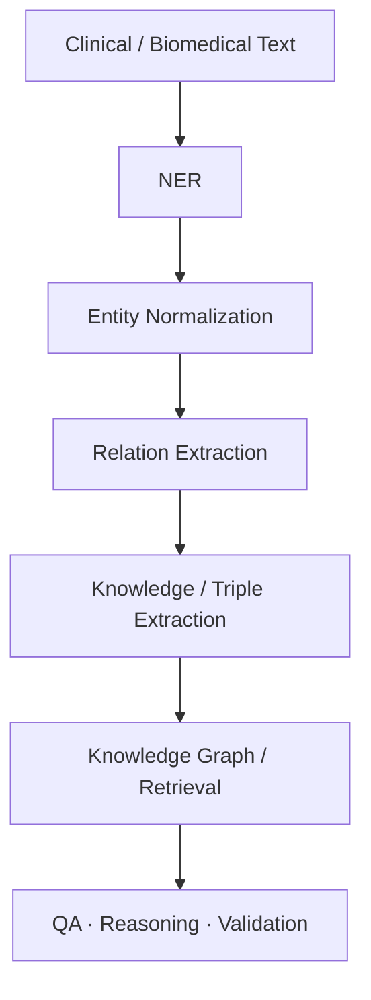

# Medical Data for Machine Learning

A curated catalog of datasets, corpora, benchmarks, and public data resources for **medical AI, clinical NLP, biomedical NLP, imaging, knowledge graphs, retrieval, and evaluation**.

> **Important:** this repository is an index, not a redistribution point. Always verify the source license, data-use agreement (DUA), patient-data restrictions, and commercial-use terms before using a dataset.

## Find data by task

| I want data for… | Start here |
|---|---|
| Medical image classification, detection, segmentation, registration | [Medical imaging](datasets/medical-imaging.md) |
| Clinical records, ICU/EHR modeling, concept embeddings | [Clinical & EHR](datasets/clinical-ehr.md) |
| Clinical or biomedical named entity recognition | [Clinical & Biomedical NER](datasets/biomedical-nlp/named-entity-recognition.md) |
| Entity linking / terminology normalization | [Entity Linking & Normalization](datasets/biomedical-nlp/entity-linking-normalization.md) |
| Relation / triple extraction and knowledge graph construction | [Knowledge Extraction & KGs](datasets/biomedical-nlp/knowledge-extraction.md) |
| Biomedical QA, retrieval, semantic indexing, clinical summarization | [BioASQ](benchmarks/bioasq.md) |
| Clinical NLP shared tasks using real clinical notes | [n2c2 / i2b2](benchmarks/n2c2-i2b2.md) |
| Precision-medicine / clinical information retrieval | [TREC](benchmarks/trec.md) |
| National/public healthcare data | [National Healthcare Data](datasets/national-healthcare.md) |
| Biomedical literature and document corpora | [Biomedical Literature](datasets/biomedical-literature.md) |
| Medical speech | [Medical Speech](datasets/medical-speech.md) |
| Classic tabular medical ML datasets | [UCI Medical Datasets](datasets/uci-medical.md) |
| Medical-AI challenges and competitions | [Challenges & Benchmarks](benchmarks/README.md) |
| Patient acuity, ML metrics, agentic-AI evaluation | [Evaluation & Agentic Benchmarks](benchmarks/evaluation-agentic.md) |

## Browse by modality

**Imaging** · **Clinical text** · **Biomedical literature** · **Structured EHR** · **Claims** · **Terminology/KG** · **Speech** · **Physiological signals** · **Population/public-health data**

## Biomedical NLP at a glance

Clinical NLP and biomedical-literature NLP overlap, but they are not identical. Clinical datasets commonly contain EHR notes, discharge summaries, medications, tests, problems, PHI, temporal expressions, and procedures. Biomedical corpora commonly use PubMed/PMC and annotate diseases, chemicals, genes/proteins, species, variants, cell lines, and relations.

## Access labels used in this catalog

| Label | Meaning |
|---|---|
| `OPEN` | Public download or openly accessible resource; still verify license/terms |
| `REGISTRATION` | Account or challenge registration required |
| `DUA` | Data Use Agreement / credentialed access required |
| `REQUEST` | Access by request to authors/organizers |
| `RESTRICTED` | Usage restrictions or controlled access apply |
| `MIXED` | Access varies by collection/subtask |

**Never copy DUA-controlled clinical data into this repository.** For example, n2c2 datasets are available to approved users under a DUA and may not be redistributed through GitHub.

## Search this repository

GitHub repository search works well once the catalog is split into topic files. Useful search terms include:

`NER` · `SNOMED` · `RxNorm` · `MIMIC` · `MRI` · `relation extraction` · `knowledge graph` · `BioASQ` · `access:open`

Dataset entries also use lightweight metadata such as:

`task:ner` `modality:clinical-text` `access:dua` `terminology:snomed-ct`

## Catalog

- [All dataset categories](datasets/README.md)
- [Benchmarks and shared tasks](benchmarks/README.md)
- [Biomedical NLP](datasets/biomedical-nlp/README.md)
- [Contributing](CONTRIBUTING.md)
- [Migration / preservation note](archive/README.md)

---
#Dis
This repository is provided for informational and research-discovery purposes only. Dataset descriptions can become stale; the authoritative source is always the dataset owner or challenge organizer.
